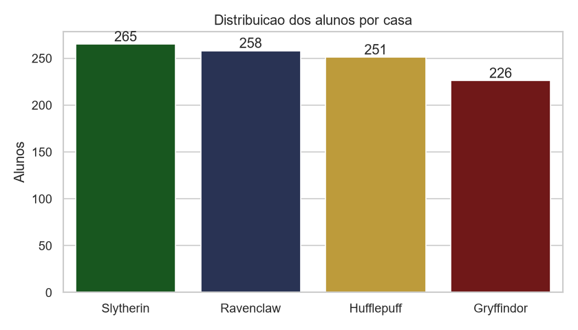
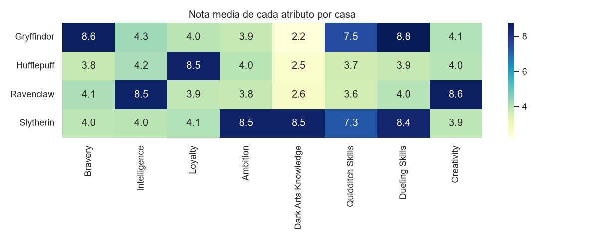
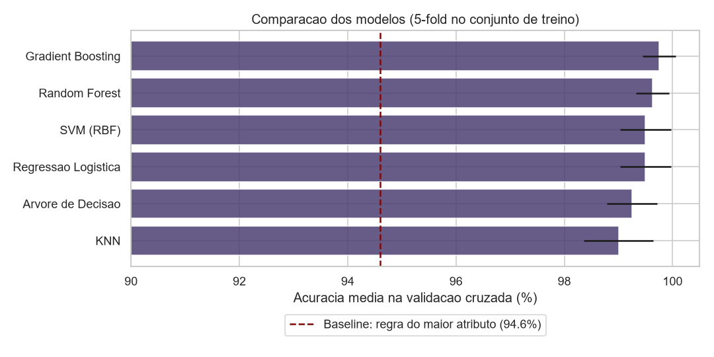
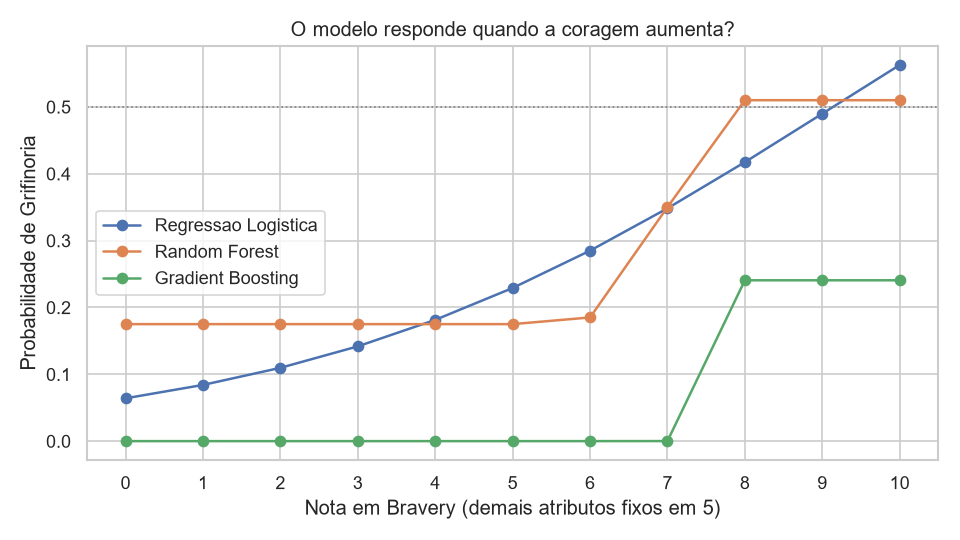
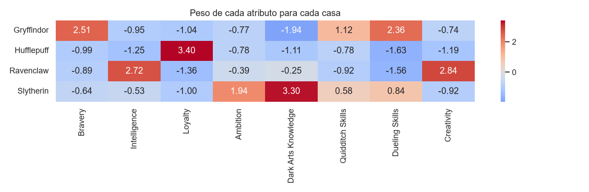
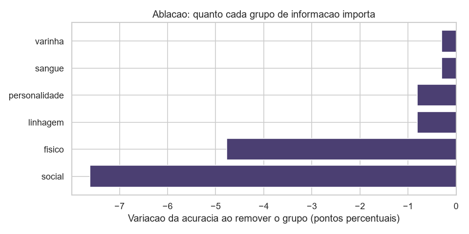
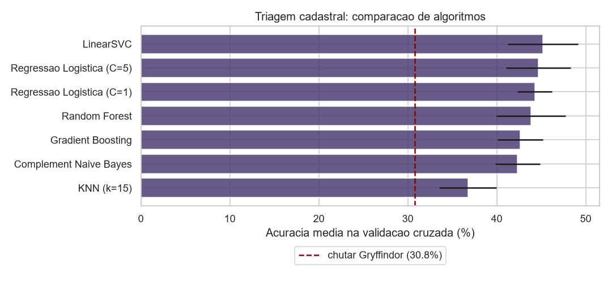

# Chapéu Seletor IA 🎩

Aplicação end-to-end de Machine Learning que digitaliza o Chapéu Seletor de
Hogwarts: dois modelos de classificação, uma API FastAPI e um sistema de gestão
para a secretaria da escola.

> **O contexto:** Hogwarts está com um número recorde de ingressantes e a
> cerimônia de seleção — feita um aluno por vez, com um chapéu de mil anos —
> virou gargalo. O Chapéu Seletor continua mandando, mas agora ele é um modelo
> treinado, e a secretaria tem um sistema pra processar a turma inteira de uma
> vez.

Projeto da disciplina de Inteligência Artificial, seguindo a arquitetura vista
em aula no [ml_fastapi_for_churn](https://github.com/chiarorosa/ml_fastapi_for_churn):

```
Dataset → preparação → treinamento → avaliação → modelo .pkl → API → aplicação
```

---

## Índice

- [As respostas da atividade](#as-respostas-da-atividade)
- [Por que dois datasets](#por-que-dois-datasets)
- [Modelo 1 — Chapéu Seletor](#modelo-1--chapéu-seletor-decisão)
- [Modelo 2 — Triagem Cadastral](#modelo-2--triagem-cadastral-sugestão)
- [Uma combinação que não vingou](#-uma-combinação-que-testei-e-não-vingou)
- [O sistema](#-o-sistema)
- [Limitações conhecidas](#-limitações-conhecidas)
- [Conclusão](#-conclusão)
- [Como rodar](#-como-rodar)
- [Endpoints](#-endpoints)

---

## As respostas da atividade

### 1. Qual dataset foi escolhido e qual problema ele representa?

Usei **dois**, porque nenhum sozinho dava conta do problema.

| | Dataset | Linhas | Entrada | Papel |
|---|---|---|---|---|
| **1** | [Harry Potter Sorting Dataset](https://www.kaggle.com/datasets/sahityapalacharla/harry-potter-sorting-dataset) | 1000 alunos fictícios | notas de traços de personalidade | **decide** a casa |
| **2** | [Hogwarts Archives](https://www.kaggle.com/datasets/sthuthimarathe/hogwarts-archives-characters-spells-and-potions) | 985 personagens **reais** | ficha cadastral | **sugere** a casa |

O modelo 1 acerta 99,5% e o modelo 2 acerta ~44%. A diferença é grande, mas faz
sentido: dados reais de personagens não registram personalidade, só o que a
escola sabe do aluno antes de avaliá-lo. O porquê dos dois datasets está
explicado [logo abaixo](#por-que-dois-datasets).

Em ambos o problema é o mesmo — **classificação supervisionada, quatro
classes** — só que a pergunta muda: o dataset 1 pergunta "dado o perfil de
personalidade, qual casa?"; o dataset 2 pergunta "dado o que a escola já sabe
do aluno, qual casa é provável?".

### 2. Qual é a variável-alvo (target)?

A casa de Hogwarts. Coluna `House` no dataset 1 e `house` no dataset 2.

### 3. Quais são as classes possíveis?

Quatro, nos dois datasets:

| Casa | Dataset 1 (fictício) | Dataset 2 (real) |
|---|---|---|
| Gryffindor (Grifinória) | 226 · 22,6% | 303 · 30,8% |
| Slytherin (Sonserina) | 265 · 26,5% | 267 · 27,1% |
| Ravenclaw (Corvinal) | 258 · 25,8% | 203 · 20,6% |
| Hufflepuff (Lufa-Lufa) | 251 · 25,1% | 212 · 21,5% |



### 4. Quais informações serão utilizadas como entrada do modelo?

**Modelo 1 (decisão)** — oito notas de 0 a 10 da avaliação de ingresso:
coragem, inteligência, lealdade, ambição, conhecimento em artes das trevas,
habilidade no quadribol, habilidade em duelos e criatividade.

**Modelo 2 (triagem)** — a ficha cadastral: sobrenome (de onde sai a casa da
família), ascendência, gênero, espécie, nacionalidade, aparência física,
estado civil, década de nascimento, varinha, patrono, bicho-papão, títulos e
profissão.

**O que ficou de fora, de propósito:** a coluna `Blood Status` no modelo 1. O
teste de qui-quadrado no [notebook 01](notebooks/01_analise_exploratoria.ipynb)
deu p = 0,53 — ou seja, essa variável não tem relação estatística nenhuma com
a casa. E mesmo que tivesse, eu não usaria: é literalmente o critério
preconceituoso que a Sonserina usa nos livros.



### 5. Quem utilizaria essa aplicação e com qual finalidade?

- **Secretaria de ingresso** — processa a turma inteira de uma vez e já sai
  com a lista de alocação pronta.
- **Coordenação e diretores de casa** — acompanham a distribuição da turma e
  recebem a fila de quem precisa de entrevista.
- **O aluno** — recebe o resultado com justificativa de quais características
  pesaram, em vez de um veredito sem explicação.

### 6. O que a aplicação fará com a classificação produzida pelo modelo?

A predição não para no nome da casa. O sistema faz quatro coisas com ela:

1. **Alocação** — define casa, dormitório, mesa do Salão Principal e monitor.
2. **Triagem de casos duvidosos** — quando a maior probabilidade fica abaixo
   de 80%, a decisão é marcada como "apertada" e o aluno vai pra entrevista em
   vez de ser confirmado automaticamente.
3. **Justificativa** — a API devolve os três atributos que mais pesaram na
   escolha, tirados dos coeficientes da regressão logística.
4. **Priorização da fila** — a triagem cadastral roda antes da cerimônia e dá
   um palpite pra secretaria organizar o atendimento, sempre deixando claro
   que é sugestão, nunca decisão.

### 7. Como seria a interface ou experiência de uso dessa solução?

Está em [`web/index.html`](web/index.html), servida pela própria API, com
quatro telas seguindo o fluxo real da secretaria:

| Tela | O que faz |
|---|---|
| **Painel** | Os dois modelos lado a lado, com acurácia e baseline, e as quatro casas |
| **Triagem** | Formulário da ficha cadastral, sugestão com as probabilidades e histórico familiar |
| **Cerimônia** | Oito sliders com as barras de probabilidade atualizando em tempo real, veredito e alerta de decisão apertada |
| **Turma** | Cola a planilha da turma, processa em lote e mostra a fila de quem precisa de entrevista |

Visual estilo "ERP feito por bruxos": fundo noturno, acentos em ouro,
tipografia serifada nos títulos, cores oficiais das casas nos resultados.
Tailwind e Alpine.js via CDN, sem build step — só subir a API.

---

## Por que dois datasets

O primeiro dataset que achei era sintético — "alunos inventados não valem".
Testei mais 3 fontes de personagens reais antes de aceitar isso:

- **Kaggle (gulsahdemiryurek)** — metade dos campos vazios.
- **HP API** — ainda mais lacuna.
- **Falas dos filmes** — 96% Grifinória, impossível generalizar.
- **Hogwarts Archives, 985 personagens** — a melhor das ruins. Virou o dataset 2.

**O problema é estrutural:** a wiki registra o que o personagem *é* (espécie,
nacionalidade), não *como ele é*. Bicho-papão e patrono — os únicos campos
de personalidade de verdade — só existem em ~6% dos personagens. Não existe
dataset real com notas de personalidade (por isso o autor do dataset
sintético teve que inventar os números).

**Solução:** uso os dois, cada um no papel que funciona:

- **Triagem** (985 reais, ~44%) → roda antes, só **sugere**.
- **Cerimônia** (1000 fictícios, 99,5%) → roda na hora, **decide**.

---

## Modelo 1 — Chapéu Seletor (decisão)

Notebooks [01](notebooks/01_analise_exploratoria.ipynb) e
[02](notebooks/02_experimentacao_modelos.ipynb).

### O modelo mais preciso foi descartado

Comparei 6 algoritmos por validação cruzada — todos acima de 99% (diferença
de 6 alunos em 800). Acurácia parou de ser critério, então fui atrás de
**onde** cada um quebra:



- **Gradient Boosting cravou 100%** — suspeito demais. Causa: nenhum aluno
  do dataset tem dois traços principais com nota 8+ ao mesmo tempo, então o
  modelo nunca viu essa combinação.
- **Teste fora da distribuição:** subi só a coragem de um perfil, resto
  fixo. O GB **ignorou a coragem** — nota 10 e continuava mandando pra
  Lufa-Lufa.



- **Personagens conhecidos:** o GB errou Harry e Hermione (foram pra
  Lufa-Lufa).
- **Teste em volume** (1000+ perfis sintéticos vs. "regra do maior
  atributo" — manda pro traço mais alto): Regressão Logística concordou em
  ~49%, Random Forest 42%, Gradient Boosting só 34%.

### Decisão final

**Regressão Logística (C=5).** Perde 0,38 ponto percentual pro Gradient
Boosting, mas ganha:

- Reação suave e coerente fora do treino (o GB reage em degraus, ou nem reage).
- Acerta os 5 personagens de teste que montei a partir dos livros.
- Probabilidade calibrada — dá pra confiar no "80% de certeza".
- Decisão explicável pelos coeficientes (mostrada ao aluno).
- Arquivo de 2,2 kB contra quase 1 MB dos outros dois.

| Métrica | Valor |
|---|---|
| Acurácia no teste (200 alunos) | 99,5% |
| F1-score macro | 99,5% |
| Acurácia 5-fold (1000 alunos) | 99,8% |
| Baseline: regra do maior atributo | 94,6% |
| Baseline: chutar a classe majoritária | 26,5% |

O único erro nos 200 alunos de teste foi um empate real (inteligência 7,
lealdade 7) — o modelo sinalizou com confiança de só 0,65, o tipo de caso que
vai pra entrevista.



Os coeficientes batem com os livros: Grifinória → coragem, Corvinal →
inteligência/criatividade, Lufa-Lufa → lealdade, Sonserina → ambição/artes
das trevas. O modelo aprendeu o padrão certo, não um atalho.

---

## Modelo 2 — Triagem Cadastral (sugestão)

[Notebook 03](notebooks/03_modelo_de_triagem_cadastral.ipynb). Aqui o
trabalho pesado foi engenharia de features e caça a vazamento de dado, não
escolha de algoritmo.

Comecei só com as colunas cruas, em one-hot: **34,5%** (baseline de chutar
Grifinória: 30,8% — quase não ajudava). Fui adicionando:

- **Casa da família**, tirada do sobrenome. No cânone é hereditária (todo
  Weasley é Grifinória), mas na prática bate só **60%** das vezes — bem
  menos que a regra de ferro dos livros. Problema no caminho: personagem sem
  nome próprio virava "família" tipo `girl`/`student`, misturando as quatro
  casas — precisei filtrar.
- **Texto livre vetorizado** (títulos, profissão) com TF-IDF. Levou a
  **44,3%**.

**Vazamento encontrado:** o campo `titles` tinha `"Head of Slytherin
House"` — a resposta escrita na própria feature, em 2,2% das linhas.
Corrigido apagando nome de casa de todos os campos de texto.

**Ablação por grupo** (o que sustenta a acurácia):



- **Social** (títulos, profissão, época) — tirando, cai quase 8 pontos.
- **Linhagem** — melhor feature isolada sozinha, mas some no modelo
  completo (títulos já carregam a mesma informação).

Entre os algoritmos, o LinearSVC ganhou por pouco, mas não tem
`predict_proba` (o sistema precisa das 4 probabilidades) — fiquei de novo
com a Regressão Logística.



| Métrica | Valor |
|---|---|
| Acurácia 5-fold (985 personagens) | 43,9% |
| Baseline (chutar Grifinória) | 30,8% |

O modelo aprende algo real — 13 pontos acima do chute não é ruído. Mas erra
mais do que acerta: os termos de maior peso são pedaços de data (`1980s`,
`august 1984`) — o modelo aprendeu *em que época* o personagem nasceu (= em
qual livro aparece), não personalidade. Por isso entra no sistema como
**triagem com revisão humana obrigatória**, explícito na interface.

---

## 🧵 Uma combinação que testei e não vingou

Tentei fazer o Chapéu Seletor decidir usando o resmungo da triagem como
informação extra — igual a cena do filme em duas etapas. Não deu certo.

- **O obstáculo:** os dois datasets são separados (nenhum aluno tem notas *e*
  ficha ao mesmo tempo). Fabriquei um sobrenome sintético pros 1000 alunos,
  calibrado nas taxas reais já medidas no projeto (14% de linhagem
  conhecida, 59,9% de concordância família→casa).
- **O teste:** 5 jeitos de usar esse sinal — probabilidades cruas,
  casa+confiança, feature de interação, grid de regularização, regra
  explícita de desempate.
- **O resultado:** nenhum ajudou. Na melhor das hipóteses o modelo empatava
  com o original (aprendia a ignorar o sinal); com mais peso, piorava.
- **A causa:** quantidade de sinal, não técnica. Linhagem só existe em 14%
  dos casos e, quando existe, acerta 59,9% — bom sinal, mas fraco demais pra
  desempatar um modelo que já acerta 99,8% sozinho.

**O Chapéu Seletor continua decidindo sozinho.** Fica documentado aqui (e o
código em `treinar_completo.py`) porque resultado negativo bem testado também
é resultado — mesmo padrão de honestidade que já valeu pros 44% da triagem.

---

## 💻 O sistema

Interface única servida pela própria API — Tailwind + Alpine.js via CDN, sem
build step. Abre em `http://localhost:8000` depois de subir o uvicorn.

**Painel** · os dois modelos lado a lado, com acurácia e baseline declarados.

**Triagem** · formulário da ficha cadastral com os selects vindos direto do
que o modelo viu no treino (rota `/api/v1/opcoes`). Mostra as quatro
probabilidades, o histórico familiar e o aviso de acurácia.

**Cerimônia** · oito sliders. As barras de probabilidade acompanham cada
ajuste em tempo real (debounce de 120ms na chamada à API). Ao confirmar, o
veredito aparece nas cores da casa, com os atributos que mais pesaram.

**Turma** · cola a planilha da avaliação, processa em lote e devolve a
distribuição por casa, a tabela de alocação e quem precisa de entrevista.

---

## ⚠️ Limitações conhecidas

**1. O modelo de decisão erra quando dois traços principais estão altos.** O
treino nunca teve um aluno com dois traços em 8+, então ele nunca aprendeu a
arbitrar entre eles. Exemplo real, tirado da turma de demonstração:

| Perfil | Coragem | Lealdade | Resultado |
|---|---|---|---|
| Coragem 9, resto baixo | 9 | 3 | Grifinória 99,2% ✅ |
| Coragem 9 **e** lealdade 8 | 9 | 8 | Lufa-Lufa 94,3% ❌ |

O coeficiente da lealdade pra Lufa-Lufa é maior que o da coragem pra
Grifinória, então em empate a Lufa-Lufa leva. Não é bug de código, é falta de
dado de treino nessa combinação. **Correção possível:** gerar exemplos
sintéticos com múltiplos traços altos, rotulados pela regra do maior
atributo.

**2. O modelo de triagem se apoia em data de nascimento** como muleta, como
descrito acima. Ele é honesto sobre isso na interface, mas segue sendo uma
limitação.

**3. O dataset de traços é sintético**, porque não existe alternativa real —
a investigação das quatro fontes está documentada acima.

**4. A feature de linhagem só cobre ~14% dos personagens do teste.** Pro
resto, a casa da família entra como "desconhecido".

---

## 🎯 Conclusão

Os dois datasets respondem perguntas diferentes, então uso os dois: a
**triagem** sugere, o **Chapéu Seletor** decide. Nenhum finge ser melhor do
que é.

O que mais valeu não foi subir acurácia — depois de 99% ela para de
significar algo — foi achar onde cada modelo quebra: o Gradient Boosting
parecia o melhor e errava o Harry e a Hermione; o vazamento nos títulos da
triagem; e a
[combinação dos dois modelos que testei e não ajudou](#-uma-combinação-que-testei-e-não-vingou).

**Próximo passo:** gerar perfis sintéticos com dois traços altos, rotulados
pela regra do maior atributo, pra ensinar o modelo a desempatar empates.

---

## 🛠️ Tecnologias

- **Dados e modelagem:** Python 3.13, pandas, scikit-learn, joblib
- **Visualização:** matplotlib, seaborn (só nos notebooks)
- **API:** FastAPI, Pydantic, Uvicorn
- **Interface:** HTML + Tailwind CSS + Alpine.js (via CDN, sem build)

## 📂 Estrutura

```
chapeu-seletor-hogwarts/
├── data/
│   ├── harry_potter_1000_students.csv     # dataset 1: alunos fictícios
│   └── harry_potter_master_data.csv       # dataset 2: personagens reais
├── notebooks/
│   ├── 01_analise_exploratoria.ipynb      # EDA, qui-quadrado, baselines
│   ├── 02_experimentacao_modelos.ipynb    # comparação e escolha do modelo 1
│   ├── 03_modelo_de_triagem_cadastral.ipynb  # features, vazamento, modelo 2
│   └── figuras/                           # gráficos gerados pelos notebooks
├── modelos/
│   ├── chapeu_seletor.pkl                 # modelo 1 (2,7 kB)
│   └── triagem_cadastral.pkl              # modelo 2 (180 kB)
├── api/
│   └── app.py                             # API FastAPI, serve os dois modelos
├── web/
│   └── index.html                         # sistema da secretaria
├── scripts/
│   └── baixar_dataset.py                  # download dos dois datasets
├── features_triagem.py                    # engenharia de features do modelo 2
├── treinar_modelo.py                      # treina e exporta o modelo 1
├── treinar_triagem.py                     # treina e exporta o modelo 2
└── requirements.txt
```

`features_triagem.py` existe porque o treino e a API precisam montar a linha
de entrada exatamente igual. Se essa lógica ficasse duplicada nos dois
lugares, uma hora ia divergir e o modelo receberia uma coluna diferente da
que foi treinada.

## 🚀 Como rodar

### 1. Ambiente

```bash
python -m venv .venv
```

```bash
.venv\Scripts\activate
```

```bash
pip install -r requirements.txt
```

### 2. Treinar os modelos

Os dois artefatos já vêm versionados. Pra gerar de novo:

```bash
python treinar_modelo.py
```

```bash
python treinar_triagem.py
```

### 3. Subir o sistema

```bash
uvicorn api.app:app --reload
```

- Sistema da secretaria: `http://localhost:8000`
- Documentação interativa (Swagger): `http://localhost:8000/docs`

### 4. Rodar os notebooks

```bash
jupyter notebook notebooks/
```

## 🔌 Endpoints

### `POST /api/v1/selecionar`

Cerimônia de seleção de um aluno (modelo de decisão).

```json
{
  "nome": "Harry Potter",
  "bravery": 10, "intelligence": 6, "loyalty": 8, "ambition": 4,
  "dark_arts_knowledge": 3, "quidditch_skills": 10,
  "dueling_skills": 9, "creativity": 5
}
```

```json
{
  "casa": "Gryffindor",
  "casa_pt": "Grifinória",
  "confianca": 0.9998,
  "probabilidades": { "Gryffindor": 0.9998, "Hufflepuff": 0.0002, "Ravenclaw": 0.0, "Slytherin": 0.0 },
  "decisao_apertada": false,
  "justificativa": [
    "coragem acima da média dos candidatos",
    "habilidade em duelos acima da média dos candidatos",
    "habilidade no quadribol acima da média dos candidatos"
  ],
  "recomendacao": "Casa confirmada. Emitir a carta de boas-vindas da Grifinória, alocar o dormitório e avisar o monitor responsável."
}
```

### `POST /api/v1/selecionar-turma`

Mesma coisa em lote (até 500 alunos), com contagem por casa e total de
decisões apertadas.

### `POST /api/v1/triagem`

Sugestão a partir da ficha cadastral (modelo de triagem). Todos os campos
exceto o nome são opcionais.

```json
{
  "casa_sugerida": "Slytherin",
  "casa_pt": "Sonserina",
  "confianca": 0.4718,
  "probabilidades": { "Slytherin": 0.4718, "Gryffindor": 0.4634, "Ravenclaw": 0.0559, "Hufflepuff": 0.0089 },
  "sugestao_confiavel": false,
  "casa_da_familia": "Slytherin",
  "acuracia_do_modelo": 0.411,
  "aviso": "Triagem estatística com acurácia de 41%. Serve para priorizar atendimento, nunca para definir a casa."
}
```

### `GET /api/v1/opcoes`

Valores válidos de cada campo do formulário de triagem, extraídos do que o
modelo viu no treino.

### `GET /api/v1/saude`

Status do serviço e metadados dos dois modelos: versão, data de treino,
limites de confiança e métricas.

## 📊 Fonte dos dados

- [Harry Potter Sorting Dataset](https://www.kaggle.com/datasets/sahityapalacharla/harry-potter-sorting-dataset),
  por Sahitya Palacharla, licença Apache 2.0. Dados fictícios.
- [Hogwarts Archives: Characters, Spells & Potions](https://www.kaggle.com/datasets/sthuthimarathe/hogwarts-archives-characters-spells-and-potions),
  por sthuthi marathe, extraído do [Harry Potter Fandom](https://harrypotter.fandom.com).

Harry Potter é propriedade da J.K. Rowling e da Warner Bros. Este é um
projeto acadêmico sem fins comerciais.

## 🤖 Uso de IA generativa

Usei IA generativa como apoio de redação e revisão deste README — organizar a
explicação, revisar o português, ajudar a estruturar as seções. As decisões do
projeto em si (escolha dos datasets, condução dos experimentos, escolha dos
modelos, implementação da API e da interface) são minhas (com exceção dos estilos), acompanhadas e
validadas por mim, e todos os números aqui saem da execução real dos
notebooks e dos scripts deste repositório — dá pra reproduzir qualquer um
rodando o código.
