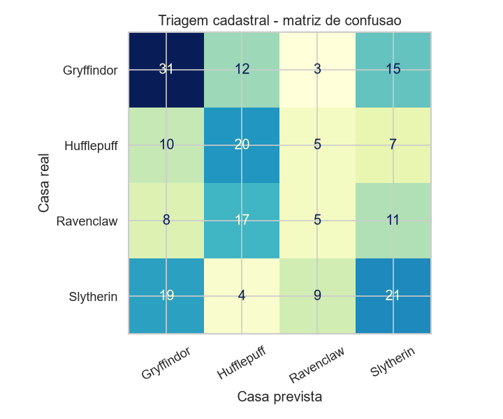

# Chapéu Seletor IA 🎩

Aplicação end-to-end de Machine Learning que digitaliza o Chapéu Seletor de
Hogwarts: dois modelos de classificação, uma API FastAPI e um sistema de gestão
para a secretaria da escola.

> **O contexto (a história do projeto):** Hogwarts está com um número recorde de
> ingressantes e a cerimônia de seleção — feita um aluno por vez, com um chapéu de
> mil anos — virou gargalo. A direção contratou uma consultoria de transformação
> digital. O Chapéu Seletor continua mandando, mas agora ele é um modelo treinado,
> e a secretaria tem um sistema para processar a turma inteira de uma vez.

Projeto da disciplina de Inteligência Artificial, seguindo a arquitetura estudada
em aula no [ml_fastapi_for_churn](https://github.com/chiarorosa/ml_fastapi_for_churn):

```
Dataset → preparação → treinamento → avaliação → modelo .pkl → API → aplicação
```

---

## Índice

- [As respostas da atividade](#as-respostas-da-atividade)
- [Como escolhi os datasets](#como-escolhi-os-datasets-a-investigação-completa)
- [Modelo 1 — Chapéu Seletor](#modelo-1--chapéu-seletor-decisão)
- [Modelo 2 — Triagem Cadastral](#modelo-2--triagem-cadastral-sugestão)
- [O sistema](#-o-sistema)
- [Limitações conhecidas](#-limitações-conhecidas)
- [Como rodar](#-como-rodar)
- [Endpoints](#-endpoints)

---

## As respostas da atividade

### 1. Qual dataset foi escolhido e qual problema ele representa?

**Dois**, porque a investigação mostrou que nenhum sozinho resolvia o problema.

| | Dataset | Linhas | Entrada | Papel |
|---|---|---|---|---|
| **1** | [Harry Potter Sorting Dataset](https://www.kaggle.com/datasets/sahityapalacharla/harry-potter-sorting-dataset) | 1000 alunos fictícios | notas de traços de personalidade | **decide** a casa |
| **2** | [Hogwarts Archives](https://www.kaggle.com/datasets/sthuthimarathe/hogwarts-archives-characters-spells-and-potions) | 985 personagens **reais** | ficha cadastral | **sugere** a casa |

O modelo 1 acerta 99.5% e o modelo 2 acerta ~44%. Essa diferença enorme não é
descuido: é a consequência direta de que dados reais de personagens não registram
personalidade. Está tudo medido e documentado abaixo.

O problema é o mesmo nos dois casos — **classificação supervisionada multiclasse**,
quatro classes — mas a pergunta é diferente. O dataset 1 pergunta *"dado o perfil de
personalidade do aluno, qual casa?"*. O dataset 2 pergunta *"dado o que a escola já
sabe do aluno antes de avaliá-lo, qual casa provavelmente será?"*.

Por que os dois, e não um só, está na [seção seguinte](#como-escolhi-os-datasets-a-investigação-completa) — é a parte mais
importante do trabalho.

### 2. Qual é a variável-alvo (target)?

A casa de Hogwarts. Coluna `House` no dataset 1 e `house` no dataset 2.

### 3. Quais são as classes possíveis?

Quatro, em ambos os datasets:

| Casa | Dataset 1 (fictício) | Dataset 2 (real) |
|---|---|---|
| Gryffindor (Grifinória) | 226 · 22.6% | 303 · 30.8% |
| Slytherin (Sonserina) | 265 · 26.5% | 267 · 27.1% |
| Ravenclaw (Corvinal) | 258 · 25.8% | 203 · 20.6% |
| Hufflepuff (Lufa-Lufa) | 251 · 25.1% | 212 · 21.5% |


### 4. Quais informações serão utilizadas como entrada do modelo?

**Modelo 1 (decisão)** — as oito notas de 0 a 10 da avaliação de ingresso:

| Atributo | O que é |
|---|---|
| `Bravery` | Coragem |
| `Intelligence` | Inteligência |
| `Loyalty` | Lealdade |
| `Ambition` | Ambição |
| `Dark Arts Knowledge` | Conhecimento em artes das trevas |
| `Quidditch Skills` | Habilidade no quadribol |
| `Dueling Skills` | Habilidade em duelos |
| `Creativity` | Criatividade |

**Modelo 2 (triagem)** — a ficha cadastral: sobrenome (de onde sai a casa da
família), ascendência, gênero, espécie, nacionalidade, cor de olhos/cabelo/pele,
estado civil, década de nascimento, madeira e núcleo da varinha, patrono, bicho-papão,
títulos e profissão.

**O que ficou de fora, de propósito:** a coluna `Blood Status` no modelo 1. O teste
de qui-quadrado no [notebook 01](notebooks/01_analise_exploratoria.ipynb) deu
**p = 0.53** — a variável é estatisticamente independente da casa, e treinar com ela
não mudou nada. Mesmo que mudasse, não entraria: é exatamente o critério
preconceituoso que a Sonserina usa nos livros.


### 5. Quem utilizaria essa aplicação e com qual finalidade?

- **Secretaria de ingresso** — processa a turma inteira de uma vez e já sai com a
  lista de alocação pronta, em vez de uma cerimônia individual por aluno.
- **Coordenação e diretores de casa** — acompanham a distribuição da turma para
  saber se algum dormitório vai estourar a capacidade, e recebem a fila dos alunos
  que precisam de entrevista.
- **O aluno** — recebe o resultado com a justificativa de quais características
  pesaram, em vez de um veredito sem explicação.

### 6. O que a aplicação fará com a classificação produzida pelo modelo?

A predição não para no nome da casa. O sistema transforma a saída em quatro coisas:

1. **Alocação** — define a casa e, a partir dela, o dormitório, a mesa do Salão
   Principal e o monitor responsável.
2. **Triagem de casos duvidosos** — o modelo devolve a probabilidade das quatro
   casas. Quando a maior fica **abaixo de 80%**, a decisão é marcada como "apertada"
   e o aluno vai para entrevista com a coordenação em vez de ser confirmado
   automaticamente. É o equivalente digital do chapéu resmungar por cinco minutos
   na cabeça do aluno.
3. **Justificativa** — a API devolve os três atributos que mais pesaram para a casa
   escolhida, calculados a partir dos coeficientes da regressão logística. Foi por
   isso que a escolha do modelo levou explicabilidade em conta.
4. **Priorização da fila** — a triagem cadastral roda antes da cerimônia e dá à
   secretaria um palpite para organizar o atendimento. Sempre com aviso explícito de
   que é sugestão, nunca decisão.

### 7. Como seria a interface ou experiência de uso dessa solução?

Está implementada em [`web/index.html`](web/index.html) e é servida pela própria
API. São quatro telas que seguem o fluxo real da secretaria:

| Tela | O que faz |
|---|---|
| **Painel** | Os dois modelos lado a lado, com acurácia e baseline honestos, e as quatro casas |
| **Triagem** | Formulário da ficha cadastral, sugestão com as quatro probabilidades e o histórico familiar |
| **Cerimônia** | Oito sliders de 0 a 10 com as barras de probabilidade atualizando **em tempo real**, veredito com justificativa e alerta de decisão apertada |
| **Turma** | Processa a turma colada em lote, mostra a distribuição por casa e a fila de quem precisa de entrevista |

O visual é um "ERP feito por bruxos": fundo noturno, acentos em ouro, tipografia
serifada (Cinzel) nos títulos e sans (Inter) nos dados, cores oficiais das casas nos
resultados. Tailwind e Alpine.js via CDN, **sem build step** — basta subir a API.

> A tela da cerimônia atualizar em tempo real não é enfeite: foi exatamente por
> causa dela que o teste de monotonicidade virou critério de escolha do modelo. Se o
> avaliador aumenta a coragem e a barra da Grifinória não se mexe, o sistema perde
> credibilidade na hora.

---

## Como escolhi os datasets (a investigação completa)

Esta é a parte que mais aprendi no projeto. O primeiro dataset que achei era
sintético, e a crítica óbvia veio logo: *"alunos inventados não valem"*. Então fui
atrás de dados de personagens reais. Testei **quatro candidatos**:

| Candidato | Personagens com casa | Veredito |
|---|---|---|
| [Kaggle `gulsahdemiryurek`](https://www.kaggle.com/datasets/gulsahdemiryurek/harry-potter-dataset) | 97 | `Eye colour` 39% nulo, `Loyalty` 36% nulo, features em texto livre |
| [HP API](https://hp-api.onrender.com/api/characters) | 135 | `patronus` 87% vazio, `wand.wood` 86%, `eyeColour` 81% |
| Falas dos filmes | 1130 falas | **96% Grifinória**, só 4 personagens sonserinos — impossível generalizar |
| **Hogwarts Archives (Fandom)** | **985** ✅ | Escolhido |

O melhor deles tem 985 personagens reais e distribuição razoável. Mas aí veio o
segundo problema:

```
chutar sempre Grifinória (baseline)              30.8%
colunas cruas, one-hot                           34.5%
```

**A causa é estrutural:** a wiki registra *o que o personagem é*, não *como ele é*.
`species` é 97% "Human", `nationality` é 91% "British or Irish". As duas colunas que
seriam traço de personalidade de verdade — `boggart` (o maior medo) e `patronus` —
estão preenchidas em **~6%**.

Não existe nenhum dataset de personagens reais com notas de traços. **Foi por isso
que o autor do dataset sintético inventou os números — não havia fonte real.**

### A conclusão: os dois datasets respondem perguntas diferentes

Em vez de escolher um e esconder a limitação do outro, o projeto usa os dois, cada
um no papel em que funciona:

```
     ┌──────────────────────────┐         ┌───────────────────────────┐
     │  Etapa 1 · TRIAGEM       │         │  Etapa 2 · CERIMÔNIA      │
     │  985 personagens reais   │         │  1000 alunos fictícios    │
     │  ficha cadastral         │   ──▶   │  notas de traços          │
     │  ~44% de acurácia        │         │  99.5% de acurácia        │
     │  SUGERE                  │         │  DECIDE                   │
     └──────────────────────────┘         └───────────────────────────┘
```

---

## Modelo 1 — Chapéu Seletor (decisão)

Notebooks [01](notebooks/01_analise_exploratoria.ipynb) e
[02](notebooks/02_experimentacao_modelos.ipynb).

### O modelo mais preciso foi descartado

**Passo 1 — comparei seis algoritmos** por validação cruzada e todos ficaram acima
de 99%. A diferença entre o primeiro e o último era de 6 alunos em 800. A acurácia
saturou e parou de servir como critério.


**Passo 2 — o Gradient Boosting cravou 100% no teste.** Em vez de comemorar, fui
investigar. Descobri que no dataset inteiro **nenhum aluno tem dois atributos
principais com nota 8 ou mais**: sempre existe um único traço dominante. Os 1000
alunos ocupam uma fatia estreitíssima do espaço de entrada.

**Passo 3 — o primeiro teste de robustez não deu em nada.** Peguei os 200 alunos do
teste e forcei uma **nota mínima** nos quatro traços principais, simulando um aluno
bom em tudo:

| | Coragem | Inteligência | Lealdade | Ambição | Casa correta |
|---|---|---|---|---|---|
| Aluno original | 9 | 2 | 3 | 1 | Gryffindor |
| Com mínimo de 6 | 9 | **6** | **6** | **6** | Gryffindor (não muda) |

Todos os modelos aguentaram, e o Gradient Boosting aguentou melhor — 100% até com
mínimo 7. Registro porque importa: **se eu tivesse parado aqui, teria colocado o
modelo errado em produção.** O teste era fraco, porque mexer nos traços fracos não
tira a dominância do traço principal.

**Passo 4 — perfis que o dataset não cobre.** Como o dataset não tem personagem
nenhum, **fui eu que montei esses perfis na mão**, atribuindo notas conforme os
livros. A coluna "esperado" é a minha leitura, não gabarito oficial. Eles nunca
entraram no treino nem em nenhuma métrica:

| Personagem | Esperado | Regressão Logística | Random Forest | Gradient Boosting |
|---|---|---|---|---|
| Harry Potter | Gryffindor | ✅ | ✅ | ❌ **Hufflepuff** |
| Hermione Granger | Ravenclaw | ✅ | ✅ | ❌ **Hufflepuff** |
| Cedrico Diggory | Hufflepuff | ✅ | ✅ | ✅ |
| Draco Malfoy | Slytherin | ✅ | ✅ | ✅ |
| Luna Lovegood | Ravenclaw | ✅ | ✅ | ✅ |

**Passo 5 — teste de monotonicidade.** Fixei todos os atributos em 5 e subi só a
coragem de 0 a 10:


O Gradient Boosting **ignora a coragem** — com nota 10 ele continua mandando o aluno
para a Lufa-Lufa. Nenhuma métrica de acurácia mostraria isso, porque o problema está
fora da distribuição de treino.

**Passo 6 — confirmei com volume.** Gerei 1377 perfis com os quatro traços
principais entre 5 e 10 e comparei com o traço dominante de cada um (a *regra do
maior atributo*):

| Modelo | Concorda com o traço dominante |
|---|---|
| Regressão Logística | **48.9%** |
| Random Forest | 41.6% |
| Gradient Boosting | 33.8% |

Os valores absolutos são baixos porque não existe gabarito real — o que interessa é
a **ordem**, igual à dos passos 4 e 5, agora com mil casos em vez de cinco.

**Passo 7 — escolha do `C`.** Com a acurácia empatada, o `GridSearchCV` pegou
`C = 0.01` no desempate arbitrário, o que achata as probabilidades. Refiz medindo
também o *log loss*: entre os empatados no topo (99.50%), o de menor log loss é
**C = 5** — `C = 0.01` tinha log loss 16× pior.

### Decisão final

| Critério | Gradient Boosting | Random Forest | **Regressão Logística** |
|---|---|---|---|
| Acurácia (validação cruzada) | 99.88% | 99.63% | 99.50% |
| Teste do aluno bom em tudo | ok | ok | ok |
| Personagens conhecidos | 3/5 | 5/5 | **5/5** |
| Responde à variação de atributo | não | em degraus | **sim, suave** |
| Perfis fora da distribuição | 33.8% | 41.6% | **48.9%** |
| Dá para explicar a decisão | difícil | difícil | **sim, coeficientes** |
| Tamanho do artefato `.pkl` | 1010 kB | 928 kB | **2.2 kB** |

**Regressão Logística com `C=5`.** Perdi 0.38 ponto percentual de acurácia para
ganhar um modelo que se comporta de forma coerente fora da distribuição de treino,
devolve probabilidade calibrada e permite explicar a decisão.

| Métrica | Valor |
|---|---|
| Acurácia no teste (200 alunos) | **99.50%** |
| F1-score macro | 99.51% |
| Log loss | 0.0133 |
| Acurácia 5-fold (1000 alunos) | 99.80% (± 0.24) |
| Baseline: regra do maior atributo | 94.60% |
| Baseline: chutar a classe majoritária | 26.50% |

As duas baselines dão régua ao resultado. A **regra do maior atributo** manda o
aluno para a casa do traço de maior nota, sem modelo nenhum — é o que um estagiário
faria com uma planilha, e já acerta 94.6%. A segunda é o piso: chutar sempre
"Sonserina" acerta 26.5%.


O único erro em 200 alunos foi um aluno com inteligência 7 e lealdade 7 — empate
real, e o modelo sinalizou devolvendo confiança de 0.647, que o sistema trata como
decisão apertada.


Os coeficientes batem com o lore, o que é um bom sinal de sanidade: Grifinória puxa
por coragem, Corvinal por inteligência e criatividade, Lufa-Lufa por lealdade,
Sonserina por ambição e artes das trevas.

---

## Modelo 2 — Triagem Cadastral (sugestão)

[Notebook 03](notebooks/03_modelo_de_triagem_cadastral.ipynb). Aqui quase todo o
trabalho foi **engenharia de features e caça a vazamento**, não escolha de algoritmo.

### O caminho, com os números de cada etapa

```
chutar sempre Grifinória                        30.8%
colunas cruas, one-hot                          34.5%
+ features construídas (linhagem, varinha)      41.7%
+ texto livre vetorizado com TF-IDF             44.3%   ← escolhido
```

**Feature 1 — a casa da família.** No cânone a casa é hereditária (todo Weasley é
Grifinória, todo Black é Sonserina). Derivei do sobrenome, com **leave-one-out**
obrigatório: incluir o próprio personagem no cálculo seria entregar a resposta.

Aqui achei um bug meu: a wiki tem muito personagem sem nome próprio
(`Unidentified 2010s Gryffindor Girl`), e pegar a última palavra criava "famílias"
falsas como `girl`, `boy` e `student`, que juntam gente das quatro casas. Depois de
filtrar, as famílias ficaram reais:

```
weasley    11 personagens  {Gryffindor: 10, Slytherin: 1}
black       8 personagens  {Slytherin: 8}
malfoy      5 personagens  {Slytherin: 5}
```

Resultado contra-intuitivo: quando a casa da família é conhecida, ela bate com a do
personagem em **59.9%** — a hereditariedade existe, mas está longe da regra férrea
que a gente lembra dos livros.

**O vazamento.** Quando cruzei tudo pela primeira vez a acurácia pulou para 42.8% e
o salto me pareceu suspeito. Fui conferir os campos de texto:

```
['Professor', 'Charms Master', 'Head of Slytherin House']
['Duelling Club Captain', 'Ravenclaw House Champion']
```

O campo `titles` continha literalmente a resposta, em 2.2% das linhas. Um modelo que
aprende isso não está prevendo nada, está lendo o gabarito. Solução: apagar o nome
das casas de **todos** os campos de texto antes de usar.

**Ablação por grupo de informação:**


| Grupo removido | Acurácia sem ele | Impacto |
|---|---|---|
| social (títulos, profissão, nacionalidade, época) | 34.1% | **−7.6 pp** |
| físico (olhos, cabelo, pele, gênero, espécie) | 37.0% | **−4.7 pp** |
| linhagem | 40.9% | −0.8 pp |
| personalidade (bicho-papão, patrono) | 40.9% | −0.8 pp |
| sangue | 41.4% | −0.3 pp |
| varinha | 41.4% | −0.3 pp |

*(modelo completo só com as categóricas: 41.7%)*

Contrariou o que eu esperava. Apostei na linhagem, mas quem sustenta o modelo é o
grupo social. Sozinha, a linhagem é a melhor feature isolada — no modelo completo
ela some quase toda, porque títulos e profissão já carregam a mesma informação por
outro caminho.

**Comparação de algoritmos** (features fixas no melhor conjunto):


| Modelo | Acurácia CV | `predict_proba`? |
|---|---|---|
| LinearSVC | **45.2%** | ❌ |
| Regressão Logística (C=5) | 44.7% | ✅ |
| Regressão Logística (C=1) | 44.3% | ✅ |
| Random Forest | 43.9% | ✅ |
| Gradient Boosting | 42.6% | ✅ |
| Complement Naive Bayes | 42.3% | ✅ |
| KNN (k=15) | 36.8% | ✅ |

Como a matriz é esparsa e tem mais colunas que linhas, os modelos lineares ganham
das árvores — confirmou a suspeita. O `LinearSVC` fica em primeiro mas **não tem
`predict_proba`**, e o sistema precisa das quatro probabilidades. Mesma decisão do
modelo 1: fica a regressão logística.

### Resultado e leitura honesta

| Métrica | Valor |
|---|---|
| **Acurácia 5-fold (985 personagens)** | **43.9%** (± 3.2) |
| Acurácia no holdout de 197 personagens | 39% a 41% |
| Baseline (chutar Grifinória) | 30.8% |

Uso a validação cruzada como número principal porque o holdout aqui tem só 197
personagens — 4 acertos a mais ou a menos mexem 2 pontos percentuais, que é
exatamente a faixa que observei entre as execuções do notebook e do script de
treino. Com desvio de ±3.2 entre os folds, cravar uma casa decimal no holdout
seria precisão falsa.



O modelo **aprende alguma coisa** — 10 pontos acima do chute não é ruído. Mas ele
erra mais do que acerta, e a leitura dos coeficientes mostra por quê: vários dos
termos de maior peso são **pedaços de data** (`1980s`, `august 1984`). Boa parte do
que ele aprendeu é *em que época o personagem nasceu*, que na prática é "em qual
livro ele aparece". Ele está memorizando coorte, não lendo personalidade.

Por isso esse modelo entra no produto como **triagem com revisão humana
obrigatória**, e a interface diz isso na cara do usuário.

---

## 💻 O sistema

Interface única servida pela própria API — Tailwind + Alpine.js via CDN, sem build
step. Abre em `http://localhost:8000` depois de subir o uvicorn.

**Painel** · os dois modelos lado a lado, com acurácia e baseline declarados, e as
quatro casas com lema e mascote.

**Triagem** · formulário da ficha cadastral com os selects preenchidos a partir dos
valores que o modelo realmente viu no treino (vêm da rota `/api/v1/opcoes`).
Mostra as quatro probabilidades, o histórico familiar quando o sobrenome é conhecido
e o aviso de acurácia.

**Cerimônia** · oito sliders. As barras de probabilidade acompanham cada ajuste em
tempo real (a cada arrasto o front chama a API com *debounce* de 120 ms). Ao
confirmar, uma pausa curta com o chapéu "pensando" e o veredito nas cores da casa,
com os três atributos que mais pesaram e o próximo passo para a secretaria.

**Turma** · cola a planilha da avaliação (uma linha por aluno, nome + 8 notas),
processa em lote e devolve a distribuição por casa, a tabela de alocação e a
contagem de quem precisa de entrevista.

---

## ⚠️ Limitações conhecidas

Documentar o que não funciona é parte do trabalho:

**1. O modelo de decisão erra quando dois traços principais são altos.** O dataset
de treino nunca tem um aluno com dois traços em 8+, então o modelo nunca aprendeu a
arbitrar entre eles. Exemplo real, tirado da turma de demonstração do sistema:

| Perfil | Coragem | Lealdade | Resultado |
|---|---|---|---|
| Coragem 9, resto baixo | 9 | 3 | Grifinória 99.2% ✅ |
| **Neville (coragem 9, lealdade 8)** | 9 | 8 | **Lufa-Lufa 94.3%** ❌ |

O coeficiente da lealdade para Lufa-Lufa (+3.40) é maior que o da coragem para
Grifinória (+2.51), então em caso de disputa a Lufa-Lufa leva. É o mesmo limite de
fora-da-distribuição do notebook 02 — não é bug de código, é falta de dado.
**Correção possível:** aumentar o treino com exemplos sintéticos de múltiplos traços
altos, rotulados pela regra do maior atributo.

**2. O modelo de triagem apoia-se em artefato de data de nascimento**, como descrito
acima. Ele é honesto sobre isso na interface, mas não deixa de ser uma muleta.

**3. O dataset de traços é sintético.** Não há alternativa real — a investigação de
quatro candidatos está documentada acima.

**4. A feature de linhagem só cobre ~14% dos personagens do teste.** Para o resto, a casa da
família entra como "desconhecido".

---

## 🛠️ Tecnologias

- **Dados e modelagem:** Python 3.13, pandas, scikit-learn, joblib
- **Visualização:** matplotlib, seaborn (só nos notebooks)
- **API:** FastAPI, Pydantic, Uvicorn
- **Interface:** HTML + Tailwind CSS + Alpine.js (via CDN, sem build)

## 📂 Estrutura

```
chapeu-seletor-hogwarts/
├── data/
│   ├── harry_potter_1000_students.csv     # dataset 1: alunos fictícios
│   └── harry_potter_master_data.csv       # dataset 2: personagens reais
├── notebooks/
│   ├── 01_analise_exploratoria.ipynb      # EDA, qui-quadrado, baselines
│   ├── 02_experimentacao_modelos.ipynb    # comparação e escolha do modelo 1
│   ├── 03_modelo_de_triagem_cadastral.ipynb  # features, vazamento, modelo 2
│   └── figuras/                           # gráficos gerados pelos notebooks
├── modelos/
│   ├── chapeu_seletor.pkl                 # modelo 1 (2.7 kB)
│   └── triagem_cadastral.pkl              # modelo 2 (180 kB)
├── api/
│   └── app.py                             # API FastAPI, serve os dois modelos
├── web/
│   └── index.html                         # sistema da secretaria
├── scripts/
│   └── baixar_dataset.py                  # download dos dois datasets
├── features_triagem.py                    # engenharia de features do modelo 2
├── treinar_modelo.py                      # treina e exporta o modelo 1
├── treinar_triagem.py                     # treina e exporta o modelo 2
└── requirements.txt
```

`features_triagem.py` existe porque o treino e a API precisam montar a linha de
entrada exatamente igual. Se essa lógica ficasse duplicada nos dois lugares, uma
hora iam divergir e o modelo receberia uma coluna diferente da que foi treinada.

## 🚀 Como rodar

### 1. Ambiente

```bash
python -m venv .venv
```

```bash
.venv\Scripts\activate
```

```bash
pip install -r requirements.txt
```

### 2. Treinar os modelos

Os dois artefatos já vêm versionados. Para gerar de novo:

```bash
python treinar_modelo.py
```

```bash
python treinar_triagem.py
```

### 3. Subir o sistema

```bash
uvicorn api.app:app --reload
```

- Sistema da secretaria: `http://localhost:8000`
- Documentação interativa (Swagger): `http://localhost:8000/docs`

### 4. Rodar os notebooks

```bash
jupyter notebook notebooks/
```

## 🔌 Endpoints

### `POST /api/v1/selecionar`

Cerimônia de seleção de um aluno (modelo de decisão).

```json
{
  "nome": "Harry Potter",
  "bravery": 10, "intelligence": 6, "loyalty": 8, "ambition": 4,
  "dark_arts_knowledge": 3, "quidditch_skills": 10,
  "dueling_skills": 9, "creativity": 5
}
```

```json
{
  "casa": "Gryffindor",
  "casa_pt": "Grifinória",
  "confianca": 0.9998,
  "probabilidades": { "Gryffindor": 0.9998, "Hufflepuff": 0.0002, "Ravenclaw": 0.0, "Slytherin": 0.0 },
  "decisao_apertada": false,
  "justificativa": [
    "coragem acima da média dos candidatos",
    "habilidade em duelos acima da média dos candidatos",
    "habilidade no quadribol acima da média dos candidatos"
  ],
  "recomendacao": "Casa confirmada. Emitir a carta de boas-vindas da Grifinória, alocar o dormitório e avisar o monitor responsável."
}
```

### `POST /api/v1/selecionar-turma`

Mesma coisa em lote (até 500 alunos), com contagem por casa e total de decisões
apertadas.

### `POST /api/v1/triagem`

Sugestão a partir da ficha cadastral (modelo de triagem). Todos os campos exceto o
nome são opcionais — ficha de aluno novo vem cheia de lacuna.

```json
{
  "casa_sugerida": "Slytherin",
  "casa_pt": "Sonserina",
  "confianca": 0.4718,
  "probabilidades": { "Slytherin": 0.4718, "Gryffindor": 0.4634, "Ravenclaw": 0.0559, "Hufflepuff": 0.0089 },
  "sugestao_confiavel": false,
  "casa_da_familia": "Slytherin",
  "acuracia_do_modelo": 0.411,
  "aviso": "Triagem estatística com acurácia de 41%. Serve para priorizar atendimento, nunca para definir a casa."
}
```

### `GET /api/v1/opcoes`

Valores válidos de cada campo do formulário de triagem, extraídos do que o modelo
viu no treino.

### `GET /api/v1/saude`

Status do serviço e metadados dos dois modelos: versão, data de treino, limites de
confiança e métricas.

## 🤖 Uso de IA generativa

Este README e a documentação dos notebooks foram escritos com auxílio de IA
generativa, usada como apoio de redação e revisão. O desenvolvimento do projeto
(escolha dos datasets, condução dos experimentos, decisão dos modelos e
implementação da API e da interface) foi acompanhado e validado por mim, e todos os
números publicados aqui saem da execução real dos notebooks e dos scripts deste
repositório — dá para reproduzir qualquer um deles rodando o código.

## 📊 Fonte dos dados

- [Harry Potter Sorting Dataset](https://www.kaggle.com/datasets/sahityapalacharla/harry-potter-sorting-dataset),
  por Sahitya Palacharla, licença Apache 2.0. Dados fictícios.
- [Hogwarts Archives: Characters, Spells & Potions](https://www.kaggle.com/datasets/sthuthimarathe/hogwarts-archives-characters-spells-and-potions),
  por sthuthi marathe, extraído do [Harry Potter Fandom](https://harrypotter.fandom.com).

Harry Potter é propriedade da J.K. Rowling e da Warner Bros. Este é um projeto
acadêmico sem fins comerciais.
