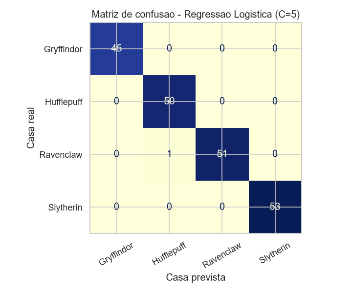

# Chapéu Seletor IA 🎩

Aplicação end-to-end de Machine Learning que transforma o Chapéu Seletor de
Hogwarts em um modelo de classificação servido por uma API.

> **O contexto (a história do projeto):** Hogwarts está com um número recorde de
> ingressantes e a cerimônia de seleção, que é feita um aluno por vez com um
> chapéu de mil anos, virou gargalo. A direção contratou uma consultoria de
> transformação digital para digitalizar o processo. O Chapéu Seletor continua
> mandando, mas agora ele é um modelo treinado com o histórico de seleções, e a
> secretaria tem um sistema para processar a turma inteira de uma vez.

Projeto da disciplina de Inteligência Artificial, seguindo a arquitetura estudada
em aula no [ml_fastapi_for_churn](https://github.com/chiarorosa/ml_fastapi_for_churn):

```
Dataset → preparação → treinamento → avaliação → modelo .pkl → API → aplicação
```

---

## As respostas da atividade

### 1. Qual dataset foi escolhido e qual problema ele representa?

[Harry Potter Sorting Dataset](https://www.kaggle.com/datasets/sahityapalacharla/harry-potter-sorting-dataset),
do Kaggle (licença Apache 2.0). São **1000 estudantes fictícios de Hogwarts**,
cada um com notas de 0 a 10 em oito atributos de personalidade e habilidade, mais
o status de sangue e a casa em que foram colocados.

O problema é de **classificação supervisionada multiclasse**: dado o perfil de um
aluno, decidir em qual das quatro casas ele entra. É o mesmo formato do churn
visto em aula, com a diferença de que aqui são quatro classes em vez de duas.

O arquivo é assim — sem nomes, sem identificação, só as notas e a casa:

```
Blood Status,Bravery,Intelligence,Loyalty,Ambition,Dark Arts Knowledge,Quidditch Skills,Dueling Skills,Creativity,House
Half-blood,9,4,7,5,0,8,8,7,Gryffindor
Muggle-born,6,8,5,7,5,6,4,9,Ravenclaw
Pure-blood,1,4,7,7,1,4,4,6,Hufflepuff
```

> **Aviso honesto sobre o dataset:** os 1000 alunos são inventados. Não existe
> nenhum personagem dos livros aqui, e ninguém mediu a lealdade ou a ambição de
> ninguém — o autor do dataset **gerou os números sinteticamente**, seguindo uma
> regra. Isso ficou evidente na experimentação, quando todos os modelos passaram
> de 99% de acurácia, e está investigado em detalhe no notebook 02.
>
> Como o objetivo da atividade é o fluxo end-to-end e não vencer um benchmark,
> isso não invalida o projeto. Mas mudou completamente o critério de escolha do
> modelo, como conto mais abaixo.

### 2. Qual é a variável-alvo (target)?

A coluna **`House`**: a casa de Hogwarts em que o aluno foi colocado.

### 3. Quais são as classes possíveis?

Quatro, bem balanceadas no dataset:

| Casa | Alunos | % |
|---|---|---|
| Slytherin (Sonserina) | 265 | 26.5% |
| Ravenclaw (Corvinal) | 258 | 25.8% |
| Hufflepuff (Lufa-Lufa) | 251 | 25.1% |
| Gryffindor (Grifinória) | 226 | 22.6% |


### 4. Quais informações serão utilizadas como entrada do modelo?

Os **oito atributos numéricos** (0 a 10) preenchidos pela comissão de ingresso:

| Atributo | O que é |
|---|---|
| `Bravery` | Coragem |
| `Intelligence` | Inteligência |
| `Loyalty` | Lealdade |
| `Ambition` | Ambição |
| `Dark Arts Knowledge` | Conhecimento em artes das trevas |
| `Quidditch Skills` | Habilidade no quadribol |
| `Dueling Skills` | Habilidade em duelos |
| `Creativity` | Criatividade |

**O que ficou de fora, de propósito:** a coluna `Blood Status` (puro-sangue,
mestiço, nascido-trouxa). O teste de qui-quadrado no notebook 01 deu **p = 0.53**,
ou seja, a variável é estatisticamente independente da casa, e treinar com ela não
mudou nada na acurácia. Mesmo que mudasse, ela não entraria: é exatamente o
critério preconceituoso que a Sonserina usa no livro, e um sistema que decide o
futuro de um aluno não pode olhar a ascendência dele.


### 5. Quem utilizaria essa aplicação e com qual finalidade?

O público principal é a **secretaria acadêmica de Hogwarts** (o "RH" da escola) e
a **coordenação das casas**:

- **Secretaria de ingresso** — processa a turma inteira de uma vez, em vez de uma
  cerimônia individual por aluno, e já sai com a lista de alocação pronta.
- **Coordenação / diretores de casa** — acompanham a distribuição da turma para
  saber se algum dormitório vai estourar a capacidade, e recebem a lista dos
  alunos que precisam de entrevista.
- **O aluno** — recebe o resultado com a justificativa de quais características
  pesaram na decisão, em vez de um veredito sem explicação.

### 6. O que a aplicação fará com a classificação produzida pelo modelo?

A predição não para no nome da casa. A aplicação transforma a saída do modelo em
três coisas:

1. **Alocação** — define a casa, e a partir dela o dormitório, a mesa do salão
   principal e o monitor responsável pelo aluno.
2. **Triagem de casos duvidosos** — o modelo devolve a probabilidade das quatro
   casas. Quando a maior fica **abaixo de 80%**, a aplicação marca a decisão como
   "apertada" e encaminha o aluno para entrevista com a coordenação, em vez de
   confirmar automaticamente. Esse limite saiu da distribuição de confiança
   analisada no notebook 02. É o equivalente digital do chapéu ficar resmungando
   na cabeça do aluno por cinco minutos.
3. **Justificativa** — a API devolve os três atributos que mais pesaram para a
   casa escolhida, calculados a partir dos coeficientes da regressão logística.
   Foi por isso que a escolha do modelo levou em conta explicabilidade.

Exemplo de resposta real da API:

```json
{
  "nome": "Harry Potter",
  "casa": "Gryffindor",
  "casa_pt": "Grifinória",
  "confianca": 0.9998,
  "probabilidades": {
    "Gryffindor": 0.9998, "Hufflepuff": 0.0002,
    "Ravenclaw": 0.0, "Slytherin": 0.0
  },
  "decisao_apertada": false,
  "justificativa": [
    "coragem acima da media dos candidatos",
    "habilidade em duelos acima da media dos candidatos",
    "habilidade no quadribol acima da media dos candidatos"
  ],
  "recomendacao": "Casa confirmada. Emitir a carta de boas-vindas da Grifinória, alocar o dormitório e avisar o monitor responsável."
}
```

### 7. Como seria a interface ou experiência de uso dessa solução?

Um **painel administrativo** da secretaria, com clima de escola de magia mas
funcionando como sistema de gestão de verdade:

- **Ficha de ingresso** — o formulário com os oito atributos em sliders de 0 a 10.
  Conforme o avaliador mexe nos valores, as quatro barras de probabilidade se
  atualizam em tempo real. Foi por causa dessa tela que o teste de monotonicidade
  virou critério de escolha do modelo: se o usuário aumenta a coragem e a barra da
  Grifinória não mexe, o sistema perde credibilidade na hora.
- **A cerimônia** — ao confirmar, uma animação do chapéu "pensando" antes de
  revelar a casa, com o resultado saindo nas cores da casa e o lema embaixo.
  Quando a confiança fica abaixo de 80%, em vez do resultado seco aparece o aviso
  de que o chapéu hesitou, com as casas que ficaram na disputa.
- **Painel da turma** — upload da planilha da turma, processamento em lote e um
  resumo com a contagem por casa, a lista de alocação e a fila de alunos que
  precisam de entrevista.

A ideia visual é misturar um sistema moderno (componentes limpos, tipografia
legível, modo escuro) com textura de pergaminho, selo de cera e bordas ornamentadas
— um ERP que parece ter sido feito por bruxos.

> A interface ainda não está implementada. A pasta `web/` está reservada para ela e
> a API já está com CORS liberado e pronta para ser consumida.

---

## A parte mais interessante: o modelo mais preciso foi descartado

Essa foi a maior lição do projeto e está toda documentada no
[notebook 02](notebooks/02_experimentacao_modelos.ipynb).

**Passo 1 — comparei seis algoritmos por validação cruzada** e todos ficaram acima
de 99%. A diferença entre o primeiro e o último colocado era de 6 alunos em 800.
Ou seja, a acurácia saturou e não servia mais como critério de escolha.


**Passo 2 — o Gradient Boosting chegou a 100% no conjunto de teste.** Em vez de
comemorar, fui investigar. Descobri que no dataset inteiro nenhum aluno tem dois
atributos principais com nota 8 ou mais: sempre existe um único traço dominante.
Os 1000 alunos ocupam uma fatia estreitíssima do espaço de entrada.

**Passo 3 — o primeiro teste de robustez não deu em nada.** A ideia era simular um
"aluno bom em tudo": peguei os 200 alunos do teste e forcei uma **nota mínima** nos
quatro traços principais, deixando o resto igual. Quem já estava acima do mínimo
não muda; quem estava abaixo sobe até ele.

| | Coragem | Inteligência | Lealdade | Ambição | Casa correta |
|---|---|---|---|---|---|
| Aluno original | 9 | 2 | 3 | 1 | Gryffindor |
| Com mínimo de 6 | 9 | **6** | **6** | **6** | Gryffindor (não muda) |

Ele continua sendo o mesmo aluno mais corajoso — só deixou de ser ruim no resto.
Se o modelo só funcionasse porque os outros traços são baixos, quebraria aqui.

**Não quebrou.** Todos aguentaram, e o Gradient Boosting aguentou melhor que os
outros: 100% até com mínimo 7. Deixo registrado porque importa — se eu tivesse
parado aqui, teria concluído que o boosting era o mais robusto e teria colocado ele
em produção. O teste era fraco: mexer nos traços fracos não tira a dominância do
traço principal, que continua em 9 e é o único que o modelo precisa enxergar.

**Passo 4 — testei os modelos com perfis que o dataset não cobre.** Aqui é preciso
ser claro sobre a origem dos dados: como o dataset não tem personagem nenhum,
**fui eu que montei esses perfis na mão**, atribuindo notas de 0 a 10 conforme o
que os livros mostram de cada um. A coluna "esperado" é a minha leitura do
personagem, não um gabarito oficial. Esses perfis nunca entraram no treino nem em
nenhuma métrica — servem só como teste de sanidade.

O que eles têm de especial é serem bons em várias coisas ao mesmo tempo (o Harry
tem coragem 10 **e** lealdade 8), situação que nenhum dos 1000 alunos do dataset
apresenta:

| Personagem | Esperado | Regressão Logística | Random Forest | Gradient Boosting |
|---|---|---|---|---|
| Harry Potter | Gryffindor | ✅ Gryffindor | ✅ Gryffindor | ❌ **Hufflepuff** |
| Hermione Granger | Ravenclaw | ✅ Ravenclaw | ✅ Ravenclaw | ❌ **Hufflepuff** |
| Cedrico Diggory | Hufflepuff | ✅ | ✅ | ✅ |
| Draco Malfoy | Slytherin | ✅ | ✅ | ✅ |
| Luna Lovegood | Ravenclaw | ✅ | ✅ | ✅ |

**Passo 5 — teste de monotonicidade.** Em vez de perturbar alunos reais, montei um
perfil artificial: fixei todos os atributos em 5 e fui subindo só a coragem de 0 a
10. Um chapéu que funciona tem que aumentar a chance de Grifinória conforme a
coragem sobe:


O Gradient Boosting simplesmente ignora a coragem — mesmo com nota 10 ele continua
mandando o aluno para a Lufa-Lufa. Nenhuma métrica de acurácia mostraria isso,
porque o problema está **fora da distribuição de treino**: esse perfil (tudo em 5)
não se parece com nenhum dos 1000 alunos do dataset, e acurácia só mede acerto em
dados parecidos com os do treino.

**Passo 6 — confirmei com volume.** Gerei 1377 perfis aleatórios com os quatro
traços principais todos entre 5 e 10 (alunos bons em várias coisas) e comparei a
predição com o traço dominante de cada um — ou seja, com a **regra do maior
atributo**: manda o aluno para a casa do traço em que ele tirou a maior nota
(coragem → Grifinória, inteligência → Corvinal, lealdade → Lufa-Lufa, ambição →
Sonserina).

| Modelo | Concorda com o traço dominante |
|---|---|
| Regressão Logística | **48.9%** |
| Random Forest | 41.6% |
| Gradient Boosting | 33.8% |

Os números absolutos são baixos porque não existe gabarito de verdade aqui — nenhum
desses alunos existe no dataset, e o "esperado" é só a regra do maior atributo. O
que interessa é a **ordem**, que é a mesma dos passos 4 e 5, agora com mais de mil
casos em vez de cinco.

**Decisão final:** Regressão Logística com `C=5`. Perdi 0.38 ponto percentual de
acurácia para ganhar um modelo que se comporta de forma coerente, devolve
probabilidade calibrada e permite explicar a decisão. Numa aplicação que decide o
destino de um aluno, é o trade-off certo.

| Critério | Gradient Boosting | Random Forest | **Regressão Logística** |
|---|---|---|---|
| Acurácia (validação cruzada) | 99.88% | 99.63% | 99.50% |
| Teste do aluno bom em tudo | ok | ok | ok |
| Personagens conhecidos | 3/5 | 5/5 | **5/5** |
| Responde à variação de atributo | não | em degraus | **sim, suave** |
| Perfis fora da distribuição | 33.8% | 41.6% | **48.9%** |
| Dá para explicar a decisão | difícil | difícil | **sim, coeficientes** |
| Tamanho do artefato `.pkl` | 1010 kB | 928 kB | **2.2 kB** (2.7 kB com os metadados) |

### Métricas do modelo final

| Métrica | Valor |
|---|---|
| Acurácia no teste (200 alunos) | **99.50%** |
| F1-score macro | 99.51% |
| Log loss | 0.0133 |
| Acurácia 5-fold (1000 alunos) | 99.80% (± 0.24) |
| Baseline: regra do maior atributo | 94.60% |
| Baseline: chutar sempre a classe majoritária | 26.50% |

As duas baselines existem para dar régua ao resultado. A **regra do maior
atributo** manda o aluno para a casa do traço em que ele tirou a maior nota, sem
modelo nenhum — é o que um estagiário faria com uma planilha, e já acerta 94.6%.
A segunda é o piso absoluto: chutar sempre "Sonserina" (a casa mais frequente)
acerta 26.5%. Um modelo só vale a pena se passar da primeira.



O único erro em 200 alunos foi um aluno com inteligência 7 e lealdade 7 — um
empate real, e o modelo sinalizou isso devolvendo confiança de apenas 0.647, que a
aplicação trataria como decisão apertada.

### O que o modelo aprendeu


Os coeficientes batem com o lore, o que é um bom sinal de sanidade: Grifinória puxa
por coragem, Corvinal por inteligência e criatividade, Lufa-Lufa por lealdade,
Sonserina por ambição e artes das trevas.

---

## 🛠️ Tecnologias

- **Dados e modelagem:** Python 3.13, pandas, scikit-learn, joblib
- **Visualização:** matplotlib, seaborn (só nos notebooks)
- **API:** FastAPI, Pydantic, Uvicorn
- **Interface:** a definir (pasta `web/`)

## 📂 Estrutura

```
chapeu-seletor-hogwarts/
├── data/
│   └── harry_potter_1000_students.csv   # dataset do Kaggle
├── notebooks/
│   ├── 01_analise_exploratoria.ipynb    # EDA, qui-quadrado, baselines
│   ├── 02_experimentacao_modelos.ipynb  # comparação e escolha do modelo
│   └── figuras/                         # gráficos gerados pelos notebooks
├── modelos/
│   └── chapeu_seletor.pkl               # artefato serializado (2.7 kB)
├── scripts/
│   └── baixar_dataset.py                # download do dataset
├── api/
│   └── app.py                           # API FastAPI
├── web/                                 # interface (próxima etapa)
├── treinar_modelo.py                    # treino + exportação do artefato
└── requirements.txt
```

## 🚀 Como rodar

### 1. Ambiente

```bash
python -m venv .venv
```

```bash
.venv\Scripts\activate
```

```bash
pip install -r requirements.txt
```

### 2. Treinar o modelo

O artefato já vem versionado no repositório, mas para gerar de novo:

```bash
python treinar_modelo.py
```

### 3. Subir a API

```bash
uvicorn api.app:app --reload
```

Documentação interativa do Swagger em `http://localhost:8000/docs`.

### 4. Rodar os notebooks

```bash
jupyter notebook notebooks/
```

## 🔌 Endpoints

### `POST /api/v1/selecionar`

Cerimônia de seleção de um aluno.

```json
{
  "nome": "Harry Potter",
  "bravery": 10, "intelligence": 6, "loyalty": 8, "ambition": 4,
  "dark_arts_knowledge": 3, "quidditch_skills": 10,
  "dueling_skills": 9, "creativity": 5
}
```

Retorna casa, nome em português, lema, cor, confiança, probabilidades das quatro
casas, o sinalizador `decisao_apertada`, a justificativa e a recomendação para a
secretaria.

### `POST /api/v1/selecionar-turma`

Mesma coisa em lote (até 500 alunos), com a contagem por casa e o total de
decisões apertadas.

```json
{ "alunos": [ { "nome": "...", "bravery": 9, "...": 0 } ] }
```

### `GET /api/v1/saude`

Status do serviço e metadados do modelo carregado (versão, data de treino, casas,
ordem dos atributos, limite de confiança e métricas).

## 🤖 Uso de IA generativa

Este README e a documentação dos notebooks foram escritos com auxílio de IA
generativa, usada como apoio de redação e revisão. O desenvolvimento do projeto
(escolha do dataset, condução dos experimentos, decisão do modelo e implementação
da API) foi acompanhado e validado por mim, e todos os números publicados aqui
saem da execução real dos notebooks e dos scripts deste repositório — dá para
reproduzir qualquer um deles rodando o código.

## 📊 Fonte dos dados

[Harry Potter Sorting Dataset](https://www.kaggle.com/datasets/sahityapalacharla/harry-potter-sorting-dataset),
por Sahitya Palacharla, licença Apache 2.0. Dados fictícios.

Harry Potter é propriedade da J.K. Rowling e da Warner Bros. Este é um projeto
acadêmico sem fins comerciais.
